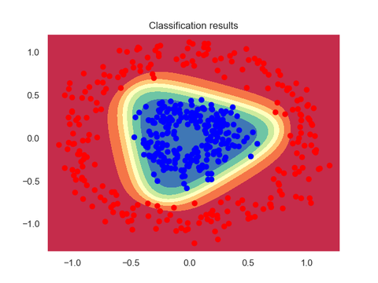

# Classify 2D data with a neural network

The goal of this lab is to mimic the experience of the [TensorFlow Playground](https://playground.tensorflow.org/#activation=tanh&batchSize=10&dataset=circle&regDataset=reg-plane&learningRate=0.03&regularizationRate=0&noise=0&networkShape=2,2&seed=0.17539&showTestData=false&discretize=false&percTrainData=50&x=true&y=true&xTimesY=false&xSquared=false&ySquared=false&cosX=false&sinX=false&cosY=false&sinY=false&collectStats=false&problem=classification&initZero=false&hideText=false). Your job is to train a neural network in a simple binary classification task on some 2D data.



The following code will help you create and load a 2D dataset, using the scikit-learn [make_circles](https://scikit-learn.org/stable/modules/generated/sklearn.datasets.make_circles.html) function. It also contains helper functions for plotting initial data and training results.

```py
import numpy as np
import matplotlib.pyplot as plt
from matplotlib.colors import ListedColormap
from sklearn.datasets import make_circles
import torch
from torch import nn
from torch.utils.data import DataLoader


def plot_2d_dataset(x, y):
    """Plot a 2-dimensional dataset with associated classes"""

    plt.figure()
    plt.plot(x[y == 0, 0], x[y == 0, 1], "or", label=0)
    plt.plot(x[y == 1, 0], x[y == 1, 1], "ob", label=1)
    plt.legend()
    plt.title("2D dataset for binary classification")
    plt.show()


def plot_decision_boundary(model, x, y, device):
    """Plot the frontier between classes for a 2-dimensional dataset.
    Note: x and y must be NumPy arrays, not PyTorch tensors."""

    plt.figure()
    # Set min and max values and give it some padding
    x_min, x_max = x[:, 0].min() - 0.1, x[:, 0].max() + 0.1
    y_min, y_max = x[:, 1].min() - 0.1, x[:, 1].max() + 0.1
    h = 0.01
    # Generate a grid of points with distance h between them
    xx, yy = np.meshgrid(np.arange(x_min, x_max, h), np.arange(y_min, y_max, h))
    # Compute model output for the whole grid
    z = model(torch.from_numpy(np.c_[xx.ravel(), yy.ravel()]).float().to(device))
    z = z.reshape(xx.shape)
    # Convert PyTorch tensor to NumPy
    zz = z.detach().cpu().numpy()
    # Plot the contour and training examples
    plt.contourf(xx, yy, zz, cmap=plt.colormaps.get_cmap("Spectral"))
    cm_bright = ListedColormap(["#FF0000", "#0000FF"])
    plt.scatter(x[:, 0], x[:, 1], c=y, cmap=cm_bright)
    plt.show()


def create_2d_dataset():
    """Create a 2D dataset"""

    # Generate 2D data (a large circle containing a smaller circle) with 2 classes
    inputs, targets = make_circles(n_samples=500, noise=0.1, factor=0.3)
    print(f"2D dataset generated. Inputs: {inputs.shape}. Targets: {targets.shape}")

    plot_2d_dataset(inputs, targets)

    return inputs, targets


def load_2d_dataset(inputs, targets, batch_size, device):
    """Load a dataset as batches"""

    # Convert dataset to PyTorch tensors
    x_train = torch.from_numpy(inputs).float().to(device)
    # PyTorch loss function expects float results of shape (batch_size, 1) instead of (batch_size,)
    # So we add a new axis and convert them to floats
    y_train = torch.from_numpy(targets[:, np.newaxis]).float().to(device)

    print(f"x_train: {x_train.shape}. y_train: {y_train.shape}")

    # Load data as randomized batches for training
    dataloader = DataLoader(
        list(zip(x_train, y_train)), batch_size=batch_size, shuffle=True
    )

    return dataloader
```
