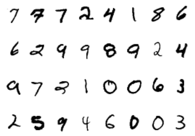

# Recognize handwritten digits

The goal of this lab is to train a neural network to recognize handwritten digits in grayscale images.

## Dataset

The [MNIST handwritten digits dataset](https://en.wikipedia.org/wiki/MNIST_database) is a staple of Machine Learning and the "Hello, World!" of computer vision. It contains 70,000 handwritten digits, stored as 28x28 grayscale images.



## Platform

You may use either a local or remote Python environment for this lab.

The easiest way to obtain a working Python setup is by using a cloud-based [Jupyter notebook](https://jupyter.org/) execution platform like [Google Colaboratory](https://colab.research.google.com/), [Paperspace](https://www.paperspace.com/notebooks) or [Kaggle Notebooks](https://www.kaggle.com/code).

## Tools

This challenge can be tackled by writing the neural network code "by hand" or by using a dedicated library. A prominent choice is [PyTorch](https://pytorch.org/), which facilitates the creation and training of networks of any size.

Follow the following tutorials if you have little to no experience with this library:

- [PyTorch Fundamentals](https://github.com/bpesquet/pytorch-tutorial/tree/main/pytorch_tutorial/fundamentals)
- [Linear Regression with PyTorch](https://github.com/bpesquet/pytorch-tutorial/tree/main/pytorch_tutorial/linear_regression)
- [Logistic Regression with PyTorch](https://github.com/bpesquet/pytorch-tutorial/tree/main/pytorch_tutorial/logistic_regression)
- [MultiLayer Perceptron with PyTorch](https://github.com/bpesquet/pytorch-tutorial/tree/main/pytorch_tutorial/multilayer_perceptron)

## Training process

You may train a classic MLP model with one hidden layer on the dataset. Make sure to define a model architecture suited to the training data, and to use the appropriate loss function for this task.

This following schema illustrates a possible architecture for your model.


*Image credits: [Michael Nielsen](https://michaelnielsen.org)*

After training, plot some digits from the test set with the associated model predictions. You may use the following function to do so.

```python
def plot_digits(dataset, device, model=None):
    """
    Plot digits from a dataset with (optionally) the associated model predictions.

    Args:
        dataset (torch.Dataset): a PyTorch dataset
        device (torch.device): a PyTorch device
        model (torch.nn.Module): a PyTorch model
    """
    figure = plt.figure()
    cols, rows = 4, 3
    for i in range(1, cols * rows + 1):
        sample_idx = torch.randint(len(dataset), size=(1,)).item()
        img, _ = dataset[sample_idx]
        figure.add_subplot(rows, cols, i)
        plt.axis("off")
        plt.imshow(img.squeeze(), cmap=plt.cm.binary)
        if model is not None:
            x_img = img.to(device)
            # Show model prediction for this image
            pred_label = model(x_img).argmax(dim=1).item()
            plt.title(f"It's a {pred_label}")

    # Return the new plot        
    return plt.gcf()
```

## Extra work

- Compute model accuracy on the test dataset.
- Experiment with the different hyperparameters and observe their impact on the training outcome.
