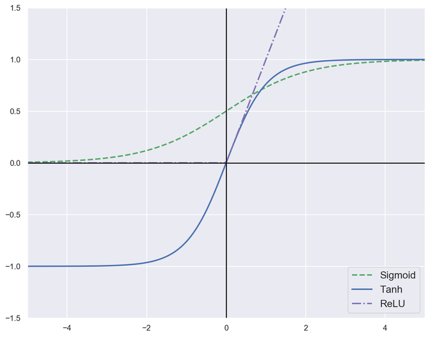
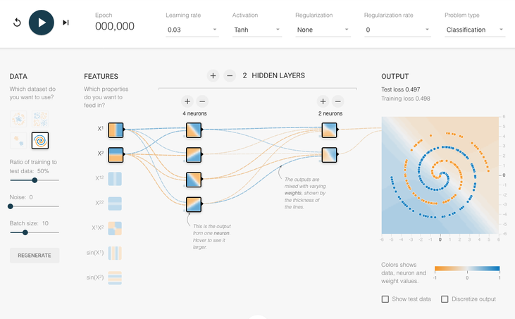

<!-- Apply header and footer to first slide only -->
<!-- _header: "" -->
<!-- _footer: "[Baptiste Pesquet](https://www.bpesquet.fr)" -->

# Feedforward Neural Networks

---

<!-- Show pagination, starting with second slide -->
<!-- paginate: true -->

## Learning objectives

- Know the possibilities, architecture and key components of a feedforward neural network.
- Understand how neural networks are trained and tuned.

---

## Toying with a neural network

[](https://playground.tensorflow.org/#activation=tanh&batchSize=10&dataset=circle&regDataset=reg-plane&learningRate=0.1&regularizationRate=0&noise=0&networkShape=2&seed=0.41559&showTestData=false&discretize=false&percTrainData=70&x=true&y=true&xTimesY=false&xSquared=false&ySquared=false&cosX=false&sinX=false&cosY=false&sinY=false&collectStats=false&problem=classification&initZero=false&hideText=false&showTestData_hide=true&problem_hide=true&regularization_hide=true&regularizationRate_hide=true&percTrainData_hide=true&noise_hide=true&dataset_hide=true)

---

## History

### A biological inspiration

---

### McCulloch & Pitts' formal neuron (1943)

---

### Hebb's rule (1949)

Attempt to explain synaptic plasticity, the adaptation of brain neurons during the learning process.

> "The general idea is an old one, that any two cells or systems of cells that are repeatedly active at the same time will tend to become 'associated' so that activity in one facilitates activity in the other."

---

### Franck Rosenblatt's perceptron (1958)

#### The perceptron learning algorithm

1. Init randomly the connection weights $\pmb{\omega}$.
1. For each training sample $\pmb{x}^{(i)}$:
    1. Compute the perceptron output $y'^{(i)}$
    1. Adjust weights : $\pmb{\omega_{t+1}} = \pmb{\omega_t} + \eta (y^{(i)} - y'^{(i)}) \pmb{x}^{(i)}$

---

### Minsky's critic (1969)

One perceptron cannot learn non-linearly separable functions.

At the time, no learning algorithm existed for training the hidden layers of a MLP.

---

### Decisive breakthroughs (1970s-1990s)

- 1974: backpropagation theory (P. Werbos).
- 1986: learning through backpropagation (Rumelhart, Hinton, Williams).
- 1989: first researchs on deep neural nets (LeCun, Bengio).
- 1991: Universal approximation theorem. Given appropriate complexity and appropriate learning, a network can theorically approximate any continuous function.

---

### Universal approximation theorem (1991)

- The hidden layers of a neural network transform their input space.

- A network can be seen as a series of non-linear compositions applied to the input data.

- Given appropriate complexity and appropriate learning, a network can theorically approximate any continuous function.

- One of the most important theoretical results for neural networks.

---

## Key components

### Anatomy of a fully connected network

---

### Neuron output

---

### Activation functions

They are applied to the weighted sum of neuron inputs to produce its output.

They must be:

- **non-linear**, so that the network has access to a richer representation space and not only linear transformations;
- **differentiable**, so that gradients can be computed during learning.

---

#### Sigmoid

This function "squashes" its input between between 0 and 1, outputting something that can be interpreted as the probability of the positive class. It is often used in the final layer of the network for binary classification tasks.

$$\sigma(x) = \frac{1}{1 + e^{-x}}$$

$$\sigma'(x) = \frac{e^{-x}}{(1 + e^{-x})^2} = \sigma(x)\big(1 - \sigma(x)\big)$$

---

#### tanh

The hyperbolic tangent function has a similar shape as sigmoid, but outputs values in the $[-1,1]$ interval.

$$tanh(x) = \frac{sinh(x)}{cosh(x)} = \frac{e^x - e^{-x}}{e^x + e^{-x}} = \frac{2}{1+e^{-2x}} -1 = 2\sigma(2x) - 1$$

$$tanh'(x) = \frac{4}{(e^x + e^{-x})^2} = \frac{1}{cosh^2(x)}$$

> [tanh is a rescaled logistic sigmoid function](https://brenocon.com/blog/2013/10/tanh-is-a-rescaled-logistic-sigmoid-function/)

---

#### ReLU

The Rectified Linear Unit function has replaced sigmoid and tanh as the default activation function in most contexts.

$$ReLU(x) = max(0,x)$$

$$ReLU'(x) =
    \begin{cases}
      0 \qquad \forall x \in\; ]-\infty, 0] \\
      1 \qquad \forall x \in\; ]0, +\infty[
    \end{cases}$$

---

#### Plotting activation functions

---

## Training process

### Learning algorithm

---

### Weights initialization

To facilitate training, initial weights must be:

- non-zero
- random
- have small values

[Several techniques exist](https://towardsdatascience.com/weight-initialization-in-neural-networks-a-journey-from-the-basics-to-kaiming-954fb9b47c79). A commonly used one is [Xavier initialization](https://proceedings.mlr.press/v9/glorot10a.html).

---

### Loss function

For binary classification tasks, the standard choice is the [binary cross-entropy loss](../../notes/classification_performance/README.md#binary-cross-entropy-loss), For each sample of the batch, it will compare the output of the model (a value $\in [0,1]$ provided by the sigmoid function) with the expected binary value $\in \{0,1\}$.

The standard choice for multiclass classification tasks is the [cross-entropy loss](../../notes/classification_performance/README.md) a.k.a. negative log-likelihood loss.

---

### Activation function for multiclass classification

The *softmax* function turns a vector $\pmb{v} = \{v_1, v_2, \dots, v_K \} \in \mathbb{R}^K$ of raws values (called a *logits vector* when it's the output of a ML model) into a probability distribution. It is a multiclass generalization of the sigmoid function.

$$\sigma(\pmb{v})_k = \frac{e^{v_k}}{\sum_{k=1}^K {e^{v_k}}}\;\;\;\;
\sum_{k=1}^K \sigma(\pmb{v})_k = 1$$

- $K$: number of labels.
- $\pmb{v}$: logits vector, i.e. raw predictions for each class.
- $\sigma(\pmb{v})_k \in [0,1]$: probability associated to label $k \in [1,K]$.

---

### Training algorithm

The training algorithm is as follows:
- On each iteration on the whole dataset (known as an *epoch*) and for each data batch inside an epoch, the model output is computed on the current batch.
- This output is used alongside expected results by the loss function to obtain the mean loss for the current batch.
- The gradient of the loss w.r.t. each model parameter is computed (backpropagation).
- The model parameters are updated in the opposite direction of their gradient (one GD step).

---

### Training hyperparameters

Hyperparameters ($\neq$ model parameters) are adjustable configuration values that let you control the model training process.

- **Number of epochs**: an epoch is finished when all data samples have been presented to the model during training
- **Learning rate**: rate of parameter change during gradient descent.
- **Batch size**: number of samples used for one gradient descent step during training.

---

### Weights update

Objective: minimize the loss function. Method: [gradient descent](principles.ipynb).

$$\pmb{\omega_{t+1}} = \pmb{\omega_t} - \eta\nabla_{\pmb{\omega}}\mathcal{L}(\pmb{\omega_t})$$

---

### Backpropagation

Objective: compute $\nabla_{\pmb{\omega}}\mathcal{L}(\pmb{\omega_t})$, the loss function gradient w.r.t. all the network weights.

Method: apply the [chain rule](https://en.wikipedia.org/wiki/Chain_rule) to compute partial derivatives backwards, starting from the current output.

$$y = f(g(x)) \;\;\;\; \frac{\partial y}{\partial x} = \frac{\partial f}{\partial g} \frac{\partial g}{\partial x}\;\;\;\; \frac{\partial y}{\partial x} = \sum_{i=1}^n \frac{\partial f}{\partial g^{(i)}} \frac{\partial g^{(i)}}{\partial x}$$

---

### Visual demo of backpropagation

---

## Tuning a neural network

## Hyperparameters choice

In general order of importance:

- Number of layers
- Number of neurons on hidden layers
- Activation functions
- Learning rate
- Batch size
- ...

---

### Tackling overfitting

#### Regularization

Limit weights values by adding a penalty to the loss function.

$$\mathcal{l1} = \frac{\lambda}{m} {\sum |{\mathbf{\theta}_{ij}}|}\;\;\;\;
\mathcal{l2} = \frac{2\lambda}{m} {\sum {\mathbf{\theta}_{ij}}^2}$$

$\lambda$ is called the **regularization rate**.

---

#### Dropout

During training, some input units are randomly set to 0. The network must adapt and become more generic. The more units dropped out, the stronger the regularization.

---

### Interactive recap

---

## Annex: implementation notes

Thie [example](test_feedforward_neural_network.py) trains a model to classify fashion images. The dataset consists of:

- a training set containing 60,000 28x28 grayscale images, each of them associated with a label (fashion category) from 10 classes;
- a test set of 10,000 images with the same properties.

A [PyTorch class](https://pytorch.org/vision/stable/generated/torchvision.datasets.FashionMNIST.html) simplifies the loading process of this dataset.

The model is defined as a subclass of the [Module](https://pytorch.org/docs/stable/generated/torch.nn.Module.html#torch.nn.Module) class. The is the standard way to create models in PyTorch. Their constructor defines the layer architecture and their `forward()` method defines the forward pass of the model. That is all PyTorch needs to compute gradients thanks to its [autodifferentiation engine](../pytorch_intro/README.md#pytorch-basics).

---

The first operation applied to model inputs is the [Flatten](https://pytorch.org/docs/stable/generated/torch.nn.Flatten.html) layer. It reshapes the input images of shape `(1, 28, 28)` into a 1D tensor (a vector) processed by the linear layers.

The training algorithm uses the [cross-entropy](../../notes/classification_performance/README.md#choosing-a-loss-function-1) a.k.a. negative log-likelihood loss, implemented by the [CrossEntropyLoss](https://pytorch.org/docs/stable/generated/torch.nn.CrossEntropyLoss.html) class.

> This is equivalent to combining the [LogSoftmax](https://pytorch.org/docs/stable/generated/torch.nn.LogSoftmax.html#torch.nn.LogSoftmax) and [NLLLoss](https://pytorch.org/docs/stable/generated/torch.nn.NLLLoss.html#torch.nn.NLLLoss) classes (see [here](../pytorch_intro/README.md#logistic-regression)).
