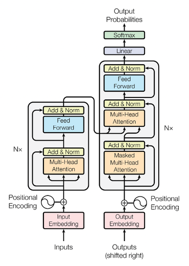
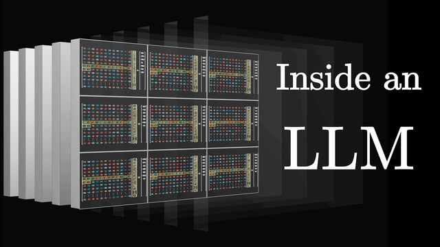
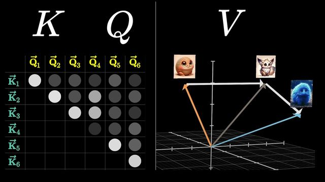
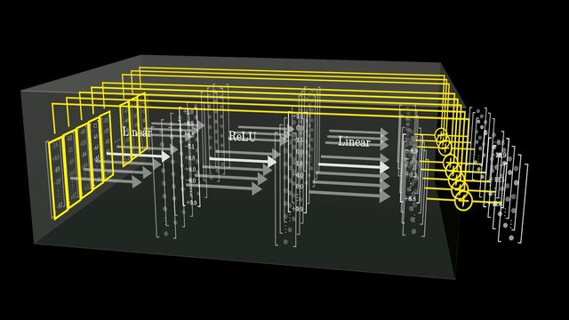
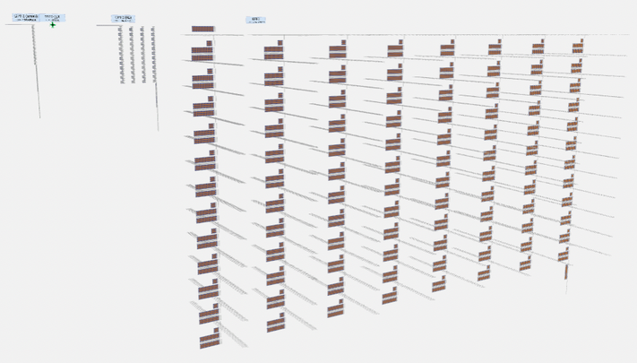
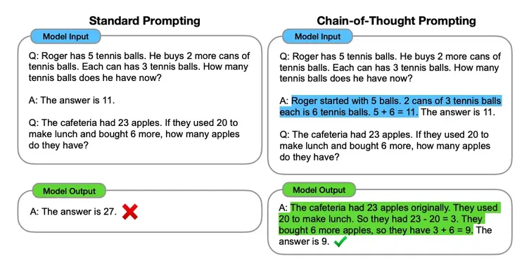

<!-- Apply header and footer to first slide only -->
<!-- _header: "" -->
<!-- _footer: "[Baptiste Pesquet](https://www.bpesquet.fr)" -->
<!-- headingDivider: 5 -->

# Large Language Models

<!-- Show pagination, starting with second slide -->
<!-- paginate: true -->

## A recent revolution

### Natural Language Processing

- Subfield of AI concerned with processing **human language**.
- Applications:
  - Speech recognition;
  - Text analysis and classification;
  - Language translation;
  - Text generation;
  - ...
- Closely related to computer science and linguistics.

### History of NLP

- 1950s-1990s: symbolic NLP
  - Rule-based approaches
  - Usage of ontologies
  - Strong reliance on linguistics
- 1990s-present: statistical NLP
  - Powered by steady increases in computational power and the availability of vast amounts of textual data.

### Notable statistical NLP models

- Word n-gram: uses only a fixed size window of $n$ previous words to compute the probability of the next word in a sequence.
- MLP:
  - **Word2vec** [[Mikolov et al., 2013](https://arxiv.org/pdf/1301.3781)]: computes vector representations of words, called *embeddings*, which capture semantic relationships.
- RNN:
  - **ELMo** [[Peters et al., 2017](https://arxiv.org/abs/1802.05365)]: word embedding method using a bidirectional LSTM.
- Transformer:
  - **BERT** [[Devlin et al., 2018](https://arxiv.org/abs/1810.04805v2)]: first breakthrough model using the Transformer architecture.
  - **ChatGPT** [[OpenAI, 2022](https://openai.com/blog/chatgpt/)]: dawn of the LLM era.

## LLMs under the hood

### The Transformer architecture

- Neural network architecture designed to handle **sequential data**.
- Based on the **attention** mechanism ([more details](https://lilianweng.github.io/posts/2018-06-24-attention/)).
- Cheaper to train and easier to parallelize than previous approaches based on RNN.

*Image credits: [[Vaswani et al., 2017](http://arxiv.org/abs/1706.03762)]*

### A visual introduction to Transformers

*Image credits: [3blue1brown](https://www.3blue1brown.com/topics/neural-networks)*

### Visualizing attention

*Image credits: [3blue1brown](https://www.3blue1brown.com/topics/neural-networks)*

### How do LLMs store facts?

*Image credits: [3blue1brown](https://www.3blue1brown.com/topics/neural-networks)*

### Examples of LLM architectures

*Image credits: [Brendan Bycroft](https://bbycroft.net/)*

### The LLM training process

1. **Self-supervised learning**: model is trained to predict the next word on enormous amounts of textual data.
1. **Supervised fine-tuning** (a.k.a; instruction tuning): model is trained to generate correct responses to specific inputs.
1. **Reinforcement Learning from Human Feedback**: model is trained for usefulness and avoidance of dangerous topics.

([More details](https://masteringllm.medium.com/llm-training-a-simple-3-step-guide-you-wont-find-anywhere-else-98ee218809e5))

### Temperature

- Intuition from thermodynamics:
  - A system at high temperature is flexible and can explore many possible states,
  - A system at lower temperature is likely to explore a subset of lower energy (better) states.

- Temperature parameter $\tau$ with $0 \le \tau \le 1$.

$$ y = \text{softmax}(\frac{u}{\tau})$$

- $\tau$ close to $1$ $\implies$ not much change in distribution.
- $\tau$ gets lower $\implies$ most probable tokens are favored.

## Using and extending LLMs

### Prompts and prompting

- **User prompt**: input or query provided to a LLM by a user.
- **System prompt**: specialized type of prompt that sets the overall context, behavior, or persona for the model's responses.
  - [Example for a coding agent](https://github.com/x1xhlol/system-prompts-and-models-of-ai-tools/blob/main/Cursor%20Prompts/Agent%20Prompt.txt)
  - [Notes on Claude 4 system prompt](https://simonwillison.net/2025/May/25/claude-4-system-prompt/)
- **Prompt engineering**: objective: developing and optimizing prompts to efficiently use a LLM ([more details](https://www.promptingguide.ai/)).

### CoT

**Chain-of-Thought** prompting  enables complex reasoning capabilities through intermediate reasoning steps.

*Image credits: [[Wei et al., 2022](https://arxiv.org/abs/2201.11903)]*

### RAG

- **Retrieval-Augmented Generation** [[Lewis et al., 2021](https://arxiv.org/pdf/2005.11401)] provides context-specific data to the model at query time, rather than training it on this data ([more details](https://blogs.nvidia.com/blog/what-is-retrieval-augmented-generation/)).
- Useful to data-backed LLM applications.
