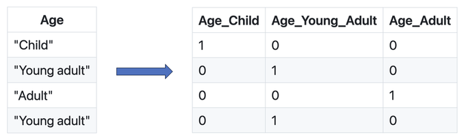

<!-- Apply header and footer to first slide only -->
<!-- _header: "" -->
<!-- _footer: "[Baptiste Pesquet](https://www.bpesquet.fr)" -->
<!-- headingDivider: 5 -->

# End-to-end project workflow

<!-- Show pagination, starting with second slide -->
<!-- paginate: true -->

## Learning objectives

- Get familiar with the general workflow of a (supervised) Machine Learning project
- Understand each step of this process, from problem definition to model deployment.
- Discover how to train a Machine Learning model on tabular data.

> You may test the trained model [here](https://housing-prices-api.herokuapp.com/).

## Standard workflow of a Machine Learning project

1. **Frame** the problem.
1. Collect, analyze and prepare **data**.
1. Select and train several **models** on data.
1. **Tune** the most promising model.
1. **Deploy** the model to production and monitor it.

## Step 1: frame the problem

### Key questions

- What is the business objective?
- How good are the current solutions?
- What data is available?
- Is the problem a good fit for ML?
- What is the expected learning type (supervised or not, batch/online...)?
- How will the model's performance be evaluated?

### Properties of ML-friendly problems

- Difficulty to express the actions as rules.
- Data too complex for traditional analytical methods.
  - High number of features.
  - Highly correlated data (data with similar or closely related values).
- Performance > interpretability.
- Data quality is paramount.

### Problem example: predict housing prices

- Regression task.
- Inputs: housing properties (number of rooms, median income, etc).
- Output: housing prices.

> It is inspired by a chapter of the book [Hands-on Machine Learning with Scikit-Learn, Keras & TensorFlow](https://github.com/ageron/handson-ml2).

## Step 2: collect, analyze and prepare data

### A crucial step

- Real data is messy, incomplete and often scattered across many sources.

- Data labeling is a manual and tedious process.

- Predefined datasets offer a convenient way to bypass the data wrangling step. Alas, using one is not always an option.

### Step 2.1: load the dataset

Many datasets containing tabular information are stored as a CSV (Comma-Separated Values) text file.

The example dataset containing housing data and prices is available [here](https://raw.githubusercontent.com/bpesquet/mlcourse/main/datasets/california_housing.csv).

### Step 2.2: analyze data

The objective here is to gain insights about the data, in order to prepare it optimally for training. This might involve:

- plotting histograms of values.
- computing statistical metrics like values repartition or correlation between features.
- ...

### Step 2.3: split the dataset

Once trained, a ML model must be able to **generalize** (perform well with new data). In order to assert this ability, data is always split into two or three sets before training:

- **Training set** (typically 80% or more): fed to the model during training.
- **Test set**: used to check the final model's performance on unseen data.
- **Validation set**: used to tune the model without biasing it in favor of the test set.

---

---

During dataset splitting, inputs (features given to the model) have to be separated from targets (values it must predict).

### Step 2.4: data preprocessing

In Machine Learning, the chosen dataset has to be carefully prepared before using it to train a model. This can have a major impact on the outcome of the training process.

This important task, sometimes called *data preprocessing*, might involve:

- Removing superflous features (if any).
- Adding missing values.
- Scaling data.
- Transforming values into numeric form.
- Augmenting data with artificially generated samples.
- Engineering new features.

#### Handling of missing values

Most ML algorithms cannot work with missing values in features.

Depending on the percentage of missing data, three options exist:

- remove the corresponding data samples;
- remove the whole feature(s);
- replace the missing values (using 0, the mean, the median or something more meaningful in the context).

#### Feature scaling

Most ML algorithms work best when all features have a similar scale. Several solutions exist:

- **Min-Max scaling**: features are shifted and rescaled to the $[0,1]$ range by substracting the `min` value and dividing by `(max-min)` on the first axis.
- **Standardization**: features are centered (substracted by their mean) then reduced (divided by their standard deviation) on the first axis. All resulting features have a mean of 0 and a standard deviation of 1.

> In order to to avoid *information leakage*, the test set must be scaled with metrics (means, categories, etc) computed on the training set ([explanation 1](https://stats.stackexchange.com/questions/174823/how-to-apply-standardization-normalization-to-train-and-testset-if-prediction-i/174865#174865), [explanation 2](https://machinelearningmastery.com/data-leakage-machine-learning/), [explanation 3](https://www.kaggle.com/code/alexisbcook/data-leakage/tutorial)).

#### Encoding of categorical features

Some features or targets may come as discrete rather than continuous values. Moreover, these discrete values might be strings. ML models are only able to manage numerical-only data.

A solution is to apply one-of-K encoding, also named **dummy encoding** or **one-hot encoding**. Each categorical feature with `K` possible values is transformed into a vector of `K` binary features, with one of them 1 and all others 0.

> Using arbitrary integer values rather than binary vectors would create a proximity relationship between the new features, which could confuse the model during training.

##### One-hot encoding example

##### One-hot encoding and training/test sets

Depending on value distribution between training and test sets, some categories might appear only in one set.

The best solution is to one-hot encode based on the training set categories, ignoring test-only categories.

#### Data augmentation

**Data augmentation** is the process of enriching a dataset by adding new samples, slightly modified copies of existing data or newly created synthetic data.

#### Feature engineering

**Feature engineering** is the process of preparing the proper input features, in order to facilitate the learning task. The problem is made easier by expressing it in a simpler way. This usually requires a good domain knowledge.

The ability of deep neural networks to discover useful features by themselves has somewhat reduced the criticality of feature engineering. Nevertheless, it remains important in order to solve problems more elegantly and with fewer data.

---

Example (taken from the book [Deep Learning with Python](https://github.com/fchollet/deep-learning-with-python-notebooks)): the task of learning the time of day from a clock is far easier with engineered features rather than raw clock images.

## Step 3: select and train models

### An iterative and empirical step

At long last, our data is ready and we can start training models.

This step is often iterative and can be quite empirical. Depending on data and model complexity, it can also be resource-intensive.

### The optimization/generalization dilemna

#### Underfitting and overfitting

- **Underfitting** (sometimes called *bias*): insufficient performance on training set.
- **Overfitting** (sometimes called *variance*): performance gap between training and validation sets.

Ultimately, we look for a tradeoff between underfitting and overfitting.

The goal of the training step is to find a model powerful enough to **overfit the training set**.

#### Possible solutions

- Tackle underfitting:
  - Use a more complex model
  - Train the model longer

- Tackle overfitting:
  - Use more training data
  - Limit the model complexity
  - Introduce model-specific solutions

### Step 3.1: choose an evaluation metric

Model performance is assessed through an **evaluation metric**. Like the loss function, it depends on the problem type.

A classic choice for regression tasks is the **Root Mean Square Error (RMSE)**. It gives an idea of how much error the trained model typically makes in its predictions. Of course, the smaller the better in that case.

$$\mathrm{RMSE}(\pmb{Y}, \pmb{Y'}) = \sqrt{\frac{1}{m}\sum_{i=1}^m (\pmb{y'}^{(i)} - \pmb{y}^{(i)})^2}$$

**Mean Absolute Error** (less sensitive to outliers) and **MSE** may also be used.

> Assessing performance for classification tasks involves specific metrics. See [here](../classification_performance/) for more details.

### Step 3.2: start with a baseline model

For each learning type (supervised, unsupervised...), several models of various complexity exist.

It is often useful to begin the training step by using a basic model. Its results will serve as a **baseline** when training more complicated models. In some cases, its performance might even be surprisingly good.

In this example, a [Linear Regression](../linear_regression/README.md) model would be a good first choice.

### Step 3.3: try other models

After obtaining baseline results, other more sophisticated models may be tried, for example a [Decision Tree](../decision_trees_random_forests/README.md) in our case.

### Step 3.4: Use a validation set to evaluate model performance

Some results looks too good to be true. They are often cases of severe overfitting to the training set, which means the model won't perform well with unseen data.

As seen earlier, one way to assert overfitting is to split training data between a smaller training set and a **validation set**, used only to evaluate model performance after each training iteration.

#### Observing overfitting

#### Cross-validation

A more sophisticated strategy is to apply **K-fold cross validation**. Training data is randomly split into $K$ subsets called *folds*. The model is trained and evaluated $K$ times, using a different fold for validation.

## Step 4: tune the most promising model

### Step 4.1: search for the best hyperparameters

Once a model looks promising, it must be **tuned** in order to offer the best compromise between optimization and generalization.

The goal is to find the set of model properties that gives the best performance. Model properties are often called **hyperparameters** (example: maximum depth for a decision tree).

This step can be either:

- manual, tweaking model hyperparameters by hand.
- automated, using a tool to explore the model hyperparameter spaces.

### Step 4.2: check final model performance on test dataset

Now is the time to evaluate the final model on the test set that we put apart before.

> Ass [seen before](#feature-scaling), preprocessing operations should be applied to test data using preprocessing metrics computed on training data.

## Step 5: deploy to production and maintain the system

### Step 5.1: save the final model and data pipeline

This step depends on the technology stack.

It's often useful to save the pipeline of preprocessing operations (if any) alongside the trained model, since these operations must be applied to production data before using the model in inference mode.

### Step 5.2: deploy the model

This step is highly context-dependent. A deployed model is often a part of a more important system. Some common solutions:

- deploying the model as a web service accessible through an API.
- embedding the model into the user device.

The [Flask](https://flask.palletsprojects.com) web framework is often used to create a web API from a trained Python model.

> You may test the trained model [here](https://housing-prices-api.herokuapp.com/).

### Step 5.3: monitor and maintain the system

In order to guarantee an optimal quality of service, the deployed system must be carefully monitored. This may involve:

- Checking the system’s live availability and performance at regular intervals.
- Sampling the system’s predictions and evaluating them.
- Checking input data quality.
- Retraining the model on fresh data.

## Annex: implementation details

### Dataset

The [dataset](https://raw.githubusercontent.com/bpesquet/mlcourse/main/datasets/california_housing.csv) is based on the 1990 California census. It is a slightly modified version of the [original dataset](https://www.dcc.fc.up.pt/%7Eltorgo/Regression/cal_housing.html).

Nine features are numerical, one (`ocean_proximity`) is categorical. One feature (`total_bedrooms`) has missing values. `median_house_value` is the target feature (value to predict).

### Preprocessing

The scikit-learn [train_test_split](https://scikit-learn.org/stable/modules/generated/sklearn.model_selection.train_test_split.html) function is used to create training and test sets.

Data preprocessing is done through a series of sequential operations on data:

- handling missing values;
- scaling data;
- encoding categorical features.

A scikit-learn [pipeline](https://scikit-learn.org/stable/modules/compose.html#pipeline) streamlines these operations. This is useful to prevent mistakes and oversights when preprocessing new data.

### Model training

Three model architectures are tested: a [linear regression](https://scikit-learn.org/stable/modules/generated/sklearn.linear_model.LinearRegression.html), a [decision tree](https://scikit-learn.org/stable/modules/generated/sklearn.tree.DecisionTreeRegressor.html) and a [random forest](https://scikit-learn.org/stable/modules/generated/sklearn.ensemble.RandomForestRegressor.html). The last one, which gives the best results, is selected and tuned through [grid search](https://scikit-learn.org/dev/modules/generated/sklearn.model_selection.GridSearchCV.html).

The final model and preprocessing pipeline are saved using Python's built-in persistence model, [pickle](https://docs.python.org/3/library/pickle.html), through the [joblib](https://pypi.org/project/joblib/) library for efficiency reasons.
