<!-- Apply header and footer to first slide only -->
<!-- _header: "" -->
<!-- _footer: "[Baptiste Pesquet](https://www.bpesquet.fr)" -->
<!-- headingDivider: 5 -->

# Recurrent Neural Networks

<!-- Show pagination, starting with second slide -->
<!-- paginate: true -->

## RNN fundamentals

*Images credits: [Aurélien Géron](https://github.com/ageron)*

### Recurrent Neural Networks in a nutshell

- Family of neural networks that maintain some kind of **state**, contrary to feedforward networks.
- Able to handle **sequential data** (data for which there is some sort of dependency through time).
- Can process input of **arbitrary length**.
- Useful in many contexts, for example:
  - Time series analysis.
  - Natural Language Processing.
  - Audio tasks (text-to-speech, speech-to-text, music generation).

### Terminology

- **Sequence**: instance of sequential data.
- **Time step** (or *frame*): incremental change in time used to discretize the sequence.
- **Cell**: recurrent unit in a RNN.
- **Unrolling**: representing the RNN flow against the time axis.

### RNN architecture

- RNN have **loops** into them, allowing information to persist and be passed from one step of the network to the next.
- At each time step, output is a function of all inputs from previous time steps.
- Network has a form of **memory**, encoding information about the timesteps seen so far.

### Typology of RNNs

[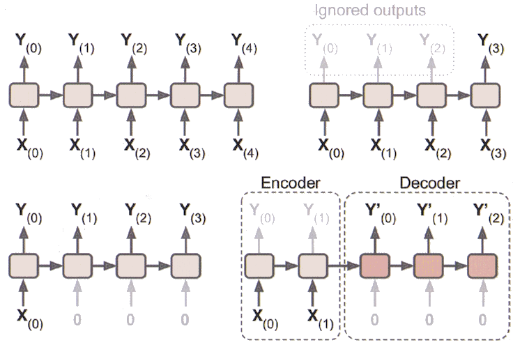](https://github.com/ageron/handson-ml2)

---

|RNN Type|In|Out|
|-|-|-|
|*Sequence-to-sequence*|An input sequence|An output sequence|
|*Sequence-to-vector*|An input sequence|Value of output sequence for last timestep|
|*Vector-to-sequence*|Single value of input sequence|An output sequence|
|*Encoder-decoder*|An input sequence|An output sequence, after encoding (*seq2vec*) and decoding (*vec2seq*)|

### Training a RNN

- Similar to a feedforward neural network that has a layer for each time step.
- Weights are shared across time.
- **Backpropagation through time** (BPTT). After the forward pass, gradients of the cost function are propagated backwards through the unrolled network ([more details](https://stats.stackexchange.com/a/220111/8706)).

[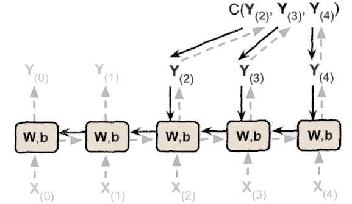](https://github.com/ageron/handson-ml2)

### Sequence format

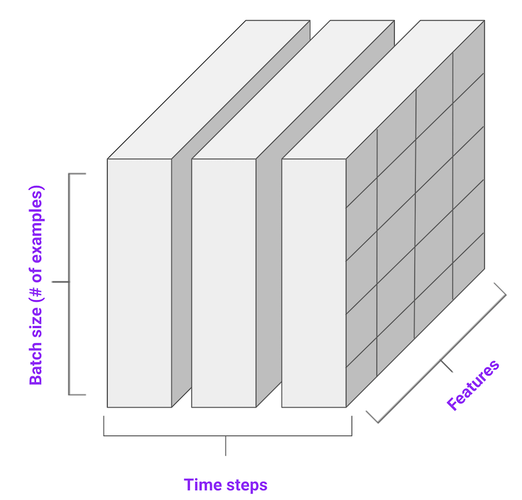

- **Batch size**: number of sequences in the batch;
- **Time steps** for each sequence;
- **Features** values of attributes at a specific time step.
  - *Univariate* sequence (2D tensor): only a single feature per time step.
  - *Multivariate* sequence (3D tensor): several features per time step.

## RNNs in action

Objective: predict the next value(s) of an univariate sequence.

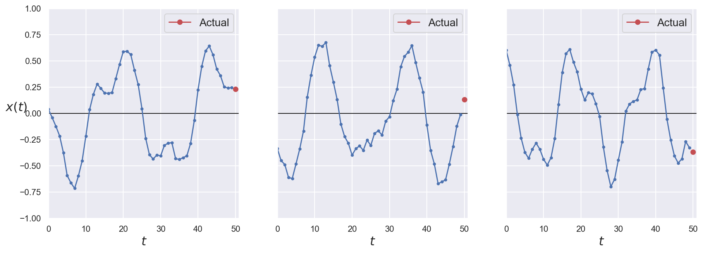

### Recurrent neuron

- Most basic form of RNN cell.
- At each time step $t$, inputs are the features vector $\mathbf{x}_{(t)}$ and its own scalar output from the previous time step $y_{(t-1)}$.

[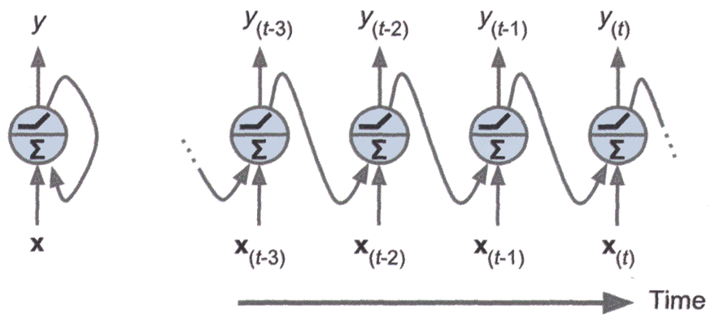](https://github.com/ageron/handson-ml2/)

### Recurrent layer

At each time step $t$, each neuron of the layer receives both the features vector $\mathbf{x}_{t}$ and the output vector of the layer from the previous time step $\mathbf{y}_{(t-1)}$.

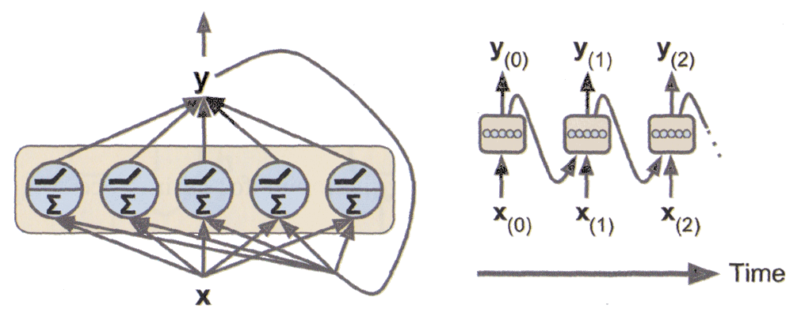

### Single-step prediction

Network architecture:

- two stacked recurrent layers of 20 neorons each;
- an output (dense) layer of 1 neuron;

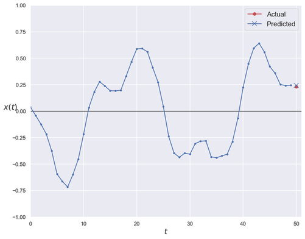

### Multi-steps prediction

- To forecast $n$ timesteps ahead, network is trained to predict all $n$ next values at once.
- Same architecture but output layer contains $n$ neurons, one for each future time step predicted.

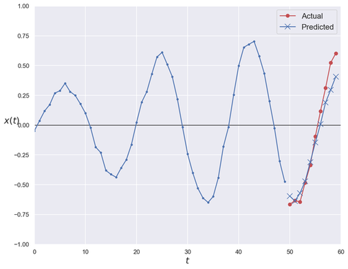

## LSTM, GRU and 1D convolutions

*Images credits: [Aurélien Géron](https://github.com/ageron)*

### The limits of recurrent neurons

- *Short-term memory* problem: because of data transformations when traversing the layers, some information is lost at each time step.
- Difficulty to handle long-term dependencies between sequence elements.
- More sophisticated RNN cell types like **LSTM** and **GRU**
alleviate this limit.

### LSTM cell

- **Long Short-Term Memory**: special kind of RNN cells, capable of learning long-term dependencies in input data [[Hochreiter and Schmidhuber, 1997](http://www.bioinf.jku.at/publications/older/2604.pdf)].
- An LSTM cell has a complex internal structure that make it able to:
  - learn to recognize an important input,
  - store it in the long-term state,
  - preserve it for as long as it is needed,
  - extract it whenever it is needed.

### LSTM internals

[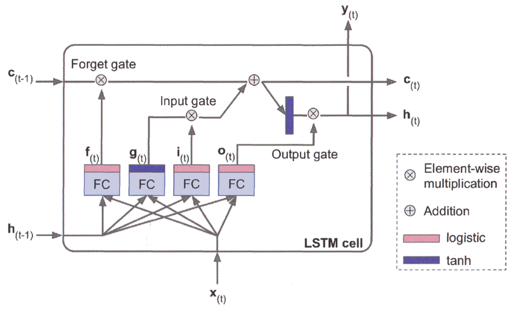](https://github.com/ageron/handson-ml2)

### LSTM state

Split between $\mathbf{h}_{(t)}$ (*short-term state*) and $\mathbf{c}_{(t)}$ (*long-term state*) ([more details](https://colah.github.io/posts/2015-08-Understanding-LSTMs/)).

- The layer that outputs $\pmb{g}_{(t)}$ is the main layer. In a basic RNN layer, there would be nothing else.
- The *forget gate* (controlled by $\pmb{f}_{(t)}$) controls which parts of the previous long-term state $\mathbf{c}_{(t-1)}$ should be erased.
- The *input gate* (controlled by $\pmb{i}_{(t)}$) controls which part of the main layer output should ne added to the long-term state.
- The *output gate* (controlled by $\pmb{o}_{(t)}$) controls which parts of the long-term state should be outputted at this time step.
- Sigmoid-based layers (*logictic*) output values near either 0 (gate closed) or 1
(gate open).

### GRU cell

*Gated Recurrent Unit* cell:  simplification of the LSTM cell that performs similarly well while being faster to train [[Cho et al., 2014](https://arxiv.org/abs/1406.1078)].

[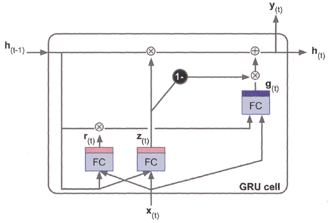](https://github.com/ageron/handson-ml2)

### GRU state

- Short- and long-time states are merged into the $\mathbf{h}_{(t)}$ vector.
- A single update gate controller $\pmb{z}_{(t)}$ manages both the forget and input gates. Whenever one is open, the other is closed.
- There is no output gate. However, the reset gate $\pmb{r}_{(t)}$ controls which part of the previous state is shown to the main layer $\pmb{g}_{(t)}$.

### Sequence processing with 1D convolutions

- LSTM and GRU cells struggle with long sequences (100 time steps or more). A solution is to shorten the sequences by using **1D convolutions**.
- Several **kernels** are slided acrsso the sequenc, treating time as a spatial dimension.
- Depending on the kernel size and *stride* (sliding step), the output sequence is typically shorter than the input one.
- 1D convolution will also detect higher-level features in the
sequence, facilitating the work of subsequent layers.

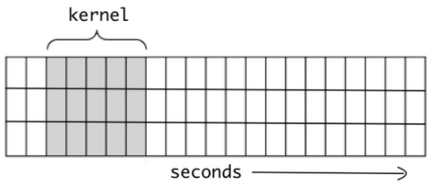
