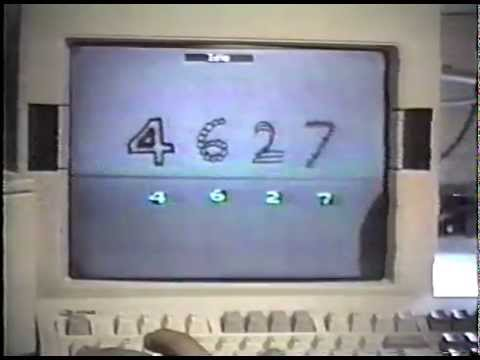

<!-- Apply header and footer to first slide only -->
<!-- _header: "" -->
<!-- _footer: "[Baptiste Pesquet](https://www.bpesquet.fr)" -->

# Convolutional Neural Networks

<!-- Show pagination, starting with second slide -->
<!-- paginate: true -->

---

## Learning objectives

- Discover the general architecture of convolutional neural networks.
- Understand why they perform better than plain neural networks for image-related tasks.

---

## Architecture

---

### Justification

The visual world has the following properties:

- Translation invariance.
- Locality: nearby pixels are more strongly correlated
- Spatial hierarchy: complex and abstract concepts are composed from simple, local elements.

Classical models are not designed to detect local patterns in images.

---

---

### General CNN design

---

### The convolution operation

Apply a **kernel** to data. Result is called a **feature map**.

---

---

### Convolution parameters

- **Filter dimensions**: 2D for images.
- **Filter size**: generally 3x3 or 5x5.
- **Number of filters**: determine the number of feature maps created by the convolution operation.
- **Stride**: step for sliding the convolution window. Generally equal to 1.
- **Padding**: blank rows/columns with all-zero values added on sides of the input feature map.

---

### Preserving output dimensions with padding

---

#### Valid padding

Output size = input size - kernel size + 1

---

#### Full padding

Output size = input size + kernel size - 1

---

#### Same padding

Output size = input size

---

### Convolutions inputs and outputs

---

### 2D convolutions on 3D tensors

- Convolution input data is 3-dimensional: images with height, width and color channels, or features maps produced by previous layers.
- Each convolution filter is a collection of *kernels* with distinct weights, one for every input channel.
- At each location, every input channel is convolved with the corresponding kernel. The results are summed to compute the (scalar) filter output for the location.
- Sliding one filter over the input data produces a 2D output feature map.

---

---

---

### Activation function

- Applied to the (scalar) convolution result.
- Introduces non-linearity in the model.
- Standard choice: ReLU.

---

### The pooling operation

- Reduces the dimensionality of feature maps.
- Often done by selecting maximum values (*max pooling*).

---

#### Pooling result

---

#### Pooling output

---

### Training process

Same principle as a dense neural network: **backpropagation** + **gradient descent**.

[Backpropagation In Convolutional Neural Networks](https://www.jefkine.com/general/2016/09/05/backpropagation-in-convolutional-neural-networks/)

---

### Interpretation

- Convolution layers act as **feature extractors**.
- Dense layers use the extracted features to classify data.

---

---

---

## History

### Humble beginnings: LeNet5 (1988)

---

---

### The breakthrough: ILSVRC

- [*ImageNet Large Scale Visual Recognition Challenge*](http://image-net.org/challenges/LSVRC/)
- Worldwide image classification challenge based on the [ImageNet](http://www.image-net.org/) dataset.

---

### AlexNet (2012)

Trained on 2 GPU for 5 to 6 days.

---

### VGG (2014)

---

### GoogLeNet/Inception (2014)

- 9 Inception modules, more than 100 layers.
- Trained on several GPU for about a week.

---

### Microsoft ResNet (2015)

- 152 layers, trained on 8 GPU for 2 to 3 weeks.
- Smaller error rate than a average human.

---

---

### Depth: challenges and solutions

- Challenges
  - Computational complexity
  - Optimization difficulties

- Solutions
  - Careful initialization
  - Sophisticated optimizers
  - Normalisation layers
  - Network design
