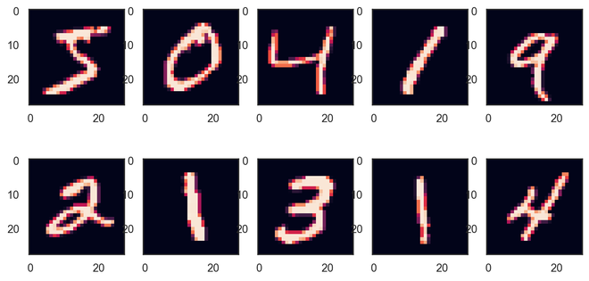
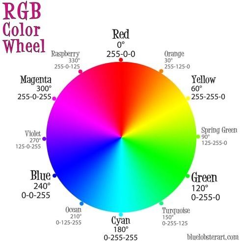

<!-- Apply header and footer to first slide only -->
<!-- _header: "" -->
<!-- _footer: "[Baptiste Pesquet](https://www.bpesquet.fr)" -->

# Recognize handwritten digits

---

<!-- Show pagination, starting with second slide -->
<!-- paginate: true -->

## Learning objectives

- Discover how to train a Machine Learning model on bitmap images.
- Understand how loss and model performance are evaluated in classification tasks.
- Discover several performance metrics and how to choose between them.

---

## Context and data preparation

### The MNIST handwritten digits dataset

This [dataset](http://yann.lecun.com/exdb/mnist/), a staple of Machine Learning and the "Hello, world!" of computer vision, contains 70,000 bitmap images of digits.

The associated label (expected result) for any image is the digit its represents.

---

### Dataset loading

Many Machine Learning librairies include this dataset as a benchmark for training models. Notable examples include [PyTorch](https://pytorch.org/vision/main/generated/torchvision.datasets.MNIST.html) and [Keras](https://keras.io/api/datasets/mnist/).

It is also possible to retrieve this dataset from several online sources, like for example [openml.org](https://openml.org/search?type=data&status=active&id=554). The scikit-learn [fetch_openml](https://scikit-learn.org/stable/modules/generated/sklearn.datasets.fetch_openml.html) function facilitates this task.

---

### Dataset splitting

Data preparation begins with splitting the dataset between training and test sets (see [here](../predict_california_housing_prices/README.md#step-23-split-the-dataset) for more details).

A common practice for the MNIST dataset is to set apart 10,000 images for the test set.

---

### Data preprocessing

#### Dealing with images

Digital images are stored using either the *bitmap* format (color values for all individual pixels in the image) or a *vectorized* format (a description of the elementary shapes in the image).

Bitmap images can be easily manipulated as tensors. Each pixel color is typically expressed using a combination of the three primary colors (red, green and blue), with an integer value between 0 and 255 for each one.

For grayscale bitmap images like those of the MNIST dataset, each pixel has only one integer value between 0 and 255.

---

---

#### Rescaling images

As [seen before](../predict_california_housing_prices/README.md#feature-scaling), many ML algorithms need their inputs to be of similar scale for optimal results.

The common rescaling solution for the pixel values of bitmap images (integers between 0 and 255) is to divide them by 255, in order to obtain float values between 0 and 1.

---

## Binary classification

### Creating binary targets

To simplify things, let's start by trying to identify one digit: the number 5. The problem is now a **binary classification** task: is a 5 present on the image or not?

---

### Choosing a loss function

This choice depends on the problem type. For binary classification tasks where expected results are either 1 (*True*) or 0 (*False*), a popular choice is the **Binary Cross Entropy loss**, a.k.a. *log(istic regression) loss*. It is implemented in the scikit-learn [log_loss](https://scikit-learn.org/stable/modules/generated/sklearn.metrics.log_loss.html) function.

$$\mathcal{L}_{\mathrm{BCE}}(\pmb{\omega}) = -\frac{1}{m}\sum_{i=1}^m \left(y^{(i)} \log_e(y'^{(i)}) + (1-y^{(i)}) \log_e(1-y'^{(i)})\right)$$

- $y^{(i)} \in \{0,1\}$: expected result for the $i$th sample.
- $y'^{(i)} = h_{\pmb{\omega}}(\pmb{x}^{(i)}) \in [0,1]$: model output for the $i$th sample, i.e. probability that the $i$th sample belongs to the positive class.

---

#### Binary cross-entropy loss

---

### Assesing model performance

Once trained, a model's performance must be evaluated with metrics dedicated to classification tasks.

#### Accuracy

The default performance metric for classification taks is **accuracy**.

$$\text{Accuracy} = \frac{\text{Number of exact predictions}}{\text{Total number of predictions}} $$

---

##### Accuracy shortcomings

When the dataset is *skewed* (some classes are more frequent than others), computing accuracy is not enough to assert the model's performance.

To find out why, let's imagine a dumb binary classifier that always predicts that the digit is not 5. Since the MNIST dataset is class-balanced (there are approx. 10% of images for each digit), this classifier would have an accuracy of approx. 90%!

---

#### True/False positives and negatives

Let's redefine accuracy using new concepts:

- **True Positive (TP)**: the model *correctly* predicts the positive class.
- **False Positive (FP)**: the model *incorrectly* predicts the positive class.
- **True Negative (TN)**: the model *correctly* predicts the negative class.
- **False Negative (FN)**: the model *incorrectly* predicts the negative class.

$$\text{Accuracy} = \frac{TP + TN}{TP + TN + FP + FN}$$

---

#### Confusion matrix

The confusion matrix is a useful representation of classification results. Row are actual classes, columns are predicted classes.

---

#### Precision and recall

- **Precision** is the proportion of all predictions for a class that were actually correct.
- **Recall** is the proportion of all samples for a class that were correctly predicted.

Example: for the positive class:

$$\text{Precision}_{positive} = \frac{TP}{TP + FP} = \frac{\text{True Positives}}{\text{Total Predicted Positives}}$$

$$\text{Recall}_{positive} = \frac{TP}{TP + FN} = \frac{\text{True Positives}}{\text{Total Actual Positives}}$$

---

#### Example: a (flawed) tumor classifier

Context: binary classification of tumors (positive means malignant). Dataset of 100 tumors, of which 9 are malignant.

| Negatives | Positives |
|-|-|
| True Negatives: 90 | False Positives: 1 |
| False Negatives: 8 | True Positives: 1|

$$\text{Accuracy} = \frac{90+1}{100} = 91\%$$

$$\text{Precision}_{positive} = \frac{1}{1 + 1} = 50\%\;\;\;
\text{Recall}_{positive} = \frac{1}{1 + 8} = 11\%$$

---

#### The precision/recall trade-off

- Improving precision typically reduces recall and vice versa ([example](https://developers.google.com/machine-learning/crash-course/classification/precision-and-recall#precision-and-recall:-a-tug-of-war)).
- Precision matters most when the cost of false positives is high (example: spam detection).
- Recall matters most when the cost of false negatives is high (example: tumor detection).

---

### F1 score

- Weighted average (*harmonic mean*) of precision and recall.
- Also known as _balanced F-score_ or _F-measure_.
- Favors classifiers that have similar precision and recall.

$$\text{F1} = 2 \times \frac{\text{Precision} \times \text{Recall}}{\text{Precision} + \text{Recall}}$$

---

## Multiclass classification

Let's switch back to our original task: recognize any of the 10 possibles digits on an image.

---

### Choosing a loss function

The log loss extends naturally to the multiclass case. It is called **Cross Entropy** a.k.a. *Negative Log-Likelihood*, and is also implemented in the scikit-learn [log_loss](https://scikit-learn.org/stable/modules/generated/sklearn.metrics.log_loss.html) function.

$$\mathcal{L}_{\mathrm{CE}}(\pmb{\omega}) = -\frac{1}{m}\sum_{i=1}^m\sum_{k=1}^K y^{(i)}_k \log_e(y'^{(i)}_k))$$

- $\pmb{y^{(i)}} \in \{0,1\}^K$: binary vector of $K$ elements.
- $y^{(i)}_k \in \{0,1\}$: expected value for the $k$th label of the $i$th sample. $y^{(i)}_k = 1$ iff the $i$th sample has label $k \in [1,K]$.
- $y'^{(i)}_k \in [0,1]$: model output for the $k$th label of the $i$th sample, i.e. probability that the $i$th sample has label $k$.

---

### Assessing model performance

Since dataset is not class imbalanced anymore, accuracy is now a reliable metric.
