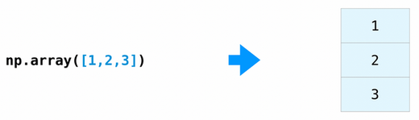
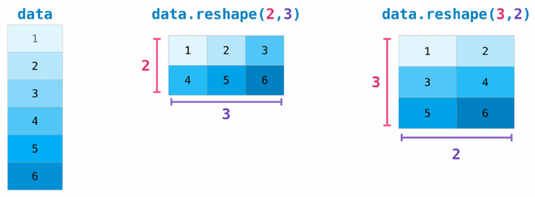
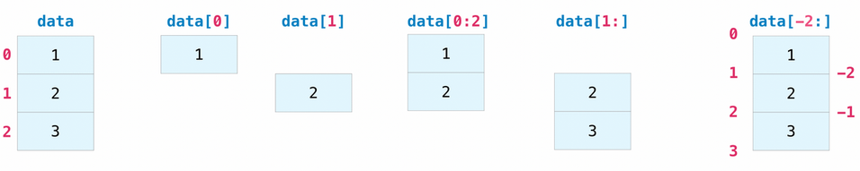
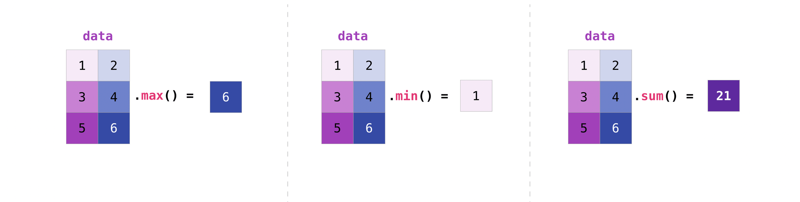
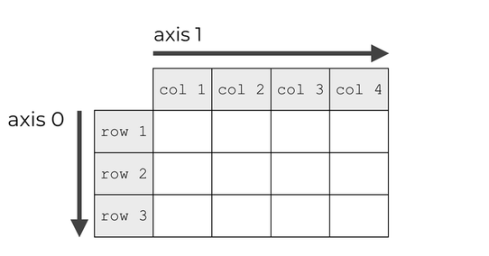
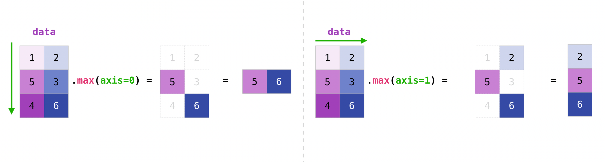
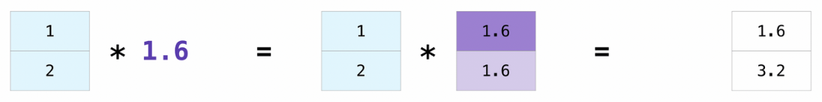

# NumPy Tutorial

> [!NOTE]
> Adapted from [NumPy: the absolute basics for beginners](https://numpy.org/doc/stable/user/absolute_beginners.html).

This tutorial teaches you the very basics of [NumPy](https://numpy.org/). Its complete source code is available [here](test_numpy.py).

## What NumPy is

**NumPy** (**Num**erical **Py**thon) is an open source Python library that's widely used in science and engineering. The NumPy library contains multidimensional array data structures, such as the homogeneous, N-dimensional `ndarray`, and a large library of functions that operate efficiently on these data structures.

> [!TIP]
> Learn more about NumPy at [What is NumPy?](https://numpy.org/doc/2.2/user/whatisnumpy.html#whatisnumpy)

## How to import NumPy

After [installing NumPy](https://numpy.org/install/), it may be imported into Python code like:

```python
import numpy as np
```

This widespread convention allows access to NumPy features with a short, recognizable prefix (`np.`) while distinguishing NumPy features from others that have the same name.

This tutorial will also use the Python [math](https://docs.python.org/3/library/math.html) module.

```python
import math
```

## Why use NumPy?

Python lists are excellent, general-purpose containers. They can be "heterogeneous", meaning that they can contain elements of a variety of types, and they are quite fast when used to perform individual operations on a handful of elements.

Depending on the characteristics of the data and the types of operations that need to be performed, other containers may be more appropriate; by exploiting these characteristics, we can improve speed, reduce memory consumption, and offer a high-level syntax for performing a variety of common processing tasks. NumPy shines when there are large quantities of "homogeneous" (same-type) data to be processed on the CPU.

## What is an "array"?

In computer programming, an array is a structure for storing and retrieving data. We often talk about an array as if it were a grid in space, with each cell storing one element of the data. For instance, if each element of the data were a number, we might visualize a "one-dimensional" array like a list:

$$
\begin{aligned}
    \begin{array}{|c|c|c|c|}
        \hline
        1 & 5 & 2 & 0 \\
        \hline
    \end{array}
\end{aligned}
$$

A two-dimensional array would be like a table:

$$
\begin{aligned}
    \begin{array}{|c|c|c|c|}
        \hline
        1 & 5 & 2 & 0 \\
        \hline
        8 & 3 & 6 & 1 \\
        \hline
        1 & 7 & 2 & 9 \\
        \hline
    \end{array}
\end{aligned}
$$

A three-dimensional array would be like a set of tables, perhaps stacked as though they were printed on separate pages. In NumPy, this idea is generalized to an arbitrary number of dimensions, and so the fundamental array class is called `ndarray`: it represents an "N-dimensional array".

Most NumPy arrays have some restrictions. For instance:

- All elements of the array must be of the same type of data.
- Once created, the total size of the array can't change.
- The shape must be "rectangular", not "jagged"; e.g., each row of a two-dimensional array must have the same number of columns.

When these conditions are met, NumPy exploits these characteristics to make the array faster, more memory efficient, and more convenient to use than less restrictive data structures.

For the remainder of this document, we will use the word "array" to refer to an instance of `ndarray`.

## Array fundamentals

One way to initialize an array is using a Python sequence, such as a list. For example:



```python
a = np.array([1, 2, 3])
print(a)
```

Elements of an array can be accessed in [various ways](https://numpy.org/doc/stable/user/quickstart.html#quickstart-indexing-slicing-and-iterating). For instance, we can access an individual element of this array as we would access an element in the original list: using the integer index of the element within square brackets.

> [!NOTE]
> The [assert](https://docs.python.org/3/reference/simple_stmts.html#grammar-token-python-grammar-assert_stmt) statements are used to check (and also illustrate) the expected results of previous statements.

```python
assert a[0] == 1
```

> [!CAUTION]
> As with built-in Python sequences, NumPy arrays are "0-indexed": the first element of the array is accessed using index `0`, not `1`.

Like the original list, the array is mutable.

> [!NOTE]
> The [np.testing.assert_allclose()](https://numpy.org/doc/2.2/reference/generated/numpy.testing.assert_allclose.html#numpy.testing.assert_allclose) function asserts equality between two NumPy arrays.

```python
a[0] = 10
# Equality test between two NumPy arrays
np.testing.assert_allclose(a, [10, 2, 3])
```

Two- and higher-dimensional arrays can be initialized from nested Python sequences:

```python
a = np.array([[1, 2, 3, 4], [5, 6, 7, 8], [9, 10, 11, 12]])
```

In NumPy, a dimension of an array is sometimes referred to as an "axis". This terminology may be useful to disambiguate between the dimensionality of an array and the dimensionality of the data represented by the array. For instance, the array `a` could represent three points, each lying within a four-dimensional space, but `a` has only two "axes".

Another difference between an array and a list of lists is that an element of the array can be accessed by specifying the index along each axis within a *single* set of square brackets, separated by commas. For instance, the element `8` is in row `1` and column `3`:

```python
assert a[1, 3] == 8
```

> [!NOTE]
> It is familiar practice in mathematics to refer to elements of a matrix by the row index first and the column index second. This happens to be true for two-dimensional arrays, but a better mental model is to think of the column index as coming *last* and the row index as *second to last*. This generalizes to arrays with *any* number of dimensions.

> [!NOTE]
> You might hear of a 0-D (zero-dimensional) array referred to as a "scalar", a 1-D (one-dimensional) array as a "vector", a 2-D (two-dimensional) array as a "matrix", or an N-D (N-dimensional, where "N" is typically an integer greater than 2) array as a "tensor". For clarity, it is best to avoid the mathematical terms when referring to an array because the mathematical objects with these names behave differently than arrays (e.g. "matrix" multiplication is fundamentally different from "array" multiplication), and there are other objects in the scientific Python ecosystem that have these names (e.g. the fundamental data structure of PyTorch is the "tensor").

## Array attributes

The number of dimensions, or axes, of an array is contained in the `ndim`
attribute.

```python
a = np.array([[1, 2, 3, 4], [5, 6, 7, 8], [9, 10, 11, 12]])

assert a.ndim == 2
```

The shape of an array is a tuple of non-negative integers that specify
the number of elements along each dimension.

```python
assert a.shape == (3, 4)
assert len(a.shape) == a.ndim
```

The fixed, total number of elements in array is contained in the `size`
attribute.

```python
assert a.size == 12
assert a.size == math.prod(a.shape)
```

Arrays are typically "homogeneous", meaning that they contain elements of only one "data type" which depends on the stored values. The data type is recorded in the `dtype` attribute.

```python
# The array contains only integers.
# The exact type may be "int64" or "int32" depending on the underlying system
print(a.dtype)
assert np.issubdtype(a.dtype, np.integer)

a = np.array([0.5, 1])
# The array contains a floating point value
assert a.dtype == np.float64
```

> [!TIP]
> Read more about array attributes [here](https://numpy.org/doc/stable/reference/arrays.ndarray.html#arrays-ndarray).

## Array creation

Besides creating an array from a sequence of elements, you can easily create an array filled with `0`'s:

```python
# Create a 1D array filled with 0s
a = np.zeros(shape=2)
np.testing.assert_allclose(a, [0, 0])
```

Or an array filled with `1`'s:

```python
# Create a 2D array filled with 1s
a = np.ones(shape=(3, 2))
np.testing.assert_allclose(a, [[1, 1], [1, 1], [1, 1]])
```

You can create an array with a range of elements:

```python
# Create a 1D array with integer values evenly spaced within a given interval
a = np.arange(stop=4)
np.testing.assert_allclose(a, [0, 1, 2, 3])
```

NumPy implements pseudo-random number generators with the ability to draw samples from a variety of probability distributions. In general, users will create a RNG instance and call the various methods on it to obtain samples from different distributions.

```python
# Init a NumPy random number generator
rng = np.random.default_rng()

# Create a 2D array with float values sampled from a uniform distribution
a = rng.uniform(size=(3, 4))
print(a)
assert a.shape == (3, 4)

# Create a 3D array with integer values sampled from a uniform distribution
a = rng.integers(low=0, high=100, size=(3, 2, 4))
print(a)
assert a.shape == (3, 2, 4)
```

## Array shape management

Arrays often need to be *reshaped*: giving them a new shape without changing
their data. The shape of an array can be changed with various commands, the most common one being [reshape()](https://numpy.org/doc/stable/reference/generated/numpy.reshape.html).

> [!CAUTION]
> The new shape must be compatible with the current one: the reshaped tensor needs to have the same number of elements as the original one.



```python
# Create a 1D array
data = np.arange(start=1, stop=7)
assert data.shape == (6,)
np.testing.assert_allclose(data, [1, 2, 3, 4, 5, 6])

# Reshape 1D array into a 2D array
b = data.reshape(2, 3)
assert b.shape == (2, 3)
np.testing.assert_allclose(b, [[1, 2, 3], [4, 5, 6]])

# Reshape 1D array into a 2D array
c = data.reshape(3, 2)
assert c.shape == (3, 2)
np.testing.assert_allclose(c, [[1, 2], [3, 4], [5, 6]])
```

You can use `np.newaxis` to increase the dimensions of your existing array. Using `np.newaxis` will increase the dimensions of your array by one dimension. This means that a **1D** array will become a **2D** array, a **2D** array will become a **3D** array, and so on.

You can explicitly convert a 1D array to either a row vector or a column vector using `np.newaxis`. For example, you can convert a 1D array to a row vector by inserting an axis along the first dimension.

```python
# Add a dimension to create a row vector from a 1D array
d = data[np.newaxis, :]
assert d.shape == (1, 6)
np.testing.assert_allclose(d, [[1, 2, 3, 4, 5, 6]])
```

Or, for a column vector, you can insert an axis along the second
dimension.

```python
# Add a dimension to create a column vector from a 1D array
e = data[:, np.newaxis]
assert e.shape == (6, 1)
np.testing.assert_allclose(e, [[1], [2], [3], [4], [5], [6]])
```

Another common operation is *flattening*: collapsing an array into one dimension. There are two popular ways to flatten an array: [flatten()](https://numpy.org/doc/2.1/reference/generated/numpy.ndarray.flatten.html) and [ravel()](https://numpy.org/doc/2.1/reference/generated/numpy.ravel.html). The primary difference between the two is that the new array created using `ravel()` is actually a reference to the parent array (i.e., a “view”). This means that any changes to the new array will affect the parent array as well. This behaviour is more momory efficient than using `flatten()`, which creates a copy of the original array.

```python
a = np.array([[1, 2, 3, 4], [5, 6, 7, 8], [9, 10, 11, 12]])

# Flatten the 2D array into a 1D array
f = a.flatten()
assert f.shape == (a.size,)
np.testing.assert_allclose(f, [1, 2, 3, 4, 5, 6, 7, 8, 9, 10, 11, 12])
# flatten() creates a copy of the original array
f[0] = 10
np.testing.assert_allclose(a, [[1, 2, 3, 4], [5, 6, 7, 8], [9, 10, 11, 12]])

# Flatten the 2D array into a 1D array
g = a.ravel()
assert g.shape == (a.size,)
np.testing.assert_allclose(g, [1, 2, 3, 4, 5, 6, 7, 8, 9, 10, 11, 12])
# ravel() creates a view of the original array sharing underlying memory
g[0] = 10
np.testing.assert_allclose(a, [[10, 2, 3, 4], [5, 6, 7, 8], [9, 10, 11, 12]])
```

> [!TIP]
> Learn more about [shape manipulation](https://numpy.org/doc/stable/user/quickstart.html#shape-manipulation).

## Indexing and slicing

You may want to take a section of your array or specific array elements
to use in further analysis or additional operations. To do that, you'll
need to subset, slice, and/or index your arrays. You can index and slice NumPy arrays in the same ways you can slice Python lists.



```python
data = np.array([1, 2, 3])

assert data[0] == 1
assert data[1] == 2

# Select elements between indexes 0 (included) and 2 (excluded)
np.testing.assert_allclose(data[0:2], [1, 2])

# Select elements starting at index 1 (included)
np.testing.assert_allclose(data[1:], [2, 3])

# Select last element
assert data[-1] == 3

# Select all elements but last one
np.testing.assert_allclose(data[:-1], [1, 2])

# Select last 2 elements
np.testing.assert_allclose(data[-2:], [2, 3])

# Select second-to-last element
np.testing.assert_allclose(data[-2:-1], [2])
```

One major difference between regular Python lists and NumPy arrays is that slice indexing of a list copies the elements into a new list, but slicing an array returns a *view*: an object that refers to the data in the original array. The original array can be mutated using the view.

```python
a = np.array([1, 2, 3, 4, 5, 6])
b = a[3:]
np.testing.assert_allclose(b, [4, 5, 6])
# Both arrays share the same underlying memory
b[0] = 40
np.testing.assert_allclose(a, [1, 2, 3, 40, 5, 6])
```

Indexing and slicing work for arrays of any dimensions.


```python
data = np.array([[1, 2], [3, 4], [5, 6]])
np.testing.assert_allclose(data[0, 1], 2)
np.testing.assert_allclose(data[1:3], [[3, 4], [5, 6]])
np.testing.assert_allclose(data[0:2, 0], [1, 3])
```

## Aggregation operations

Aggregation operations on array values are simple to implement with NumPy. If you want to find the sum of the elements in an array, you'd use `sum()`. This works for arrays of any dimension. In addition to basic aggregations like `sum()`, `min()` or `max()`, you can easily run `mean()` to get the average, `std()` to get the standard deviation, and more.



```python
data = np.array([[1, 2], [5, 3], [4, 6]])

assert np.max(data) == 6
assert np.min(data) == 1
assert np.sum(data) == 21
```

Many aggregation operations can be applied along one or several axes of the array. They are indexed starting at `0`. The following figure illustrates axes for a 2D array.

[](https://www.sharpsightlabs.com/blog/numpy-axes-explained/)

Choosing a different axis has a direct impact on the applied computation.



```python
# Finding maximum values along first axis (rows)
np.testing.assert_allclose(np.max(data, axis=0), [5, 6])

# Finding maximum values along second axis (columns)
np.testing.assert_allclose(np.max(data, axis=1), [2, 5, 6])
```

> [!TIP]
> Learn more about [aggregation operations](https://numpy.org/doc/stable/reference/arrays.ndarray.html#array-ndarray-methods).

## Operations between arrays

Once you've created several arrays, you can start combining them through operations. Let's say, for example, that you've created two arrays, one called `data` and one called `ones`.


You can add the arrays together with the `+` sign.


You can, of course, do more than just addition!


```python
data = np.array([1, 2])
ones = np.ones(2)
# Element-wise operations
np.testing.assert_allclose(data + ones, [2, 3])
np.testing.assert_allclose(data - ones, [0, 1])
np.testing.assert_allclose(data * data, [1, 4])
np.testing.assert_allclose(data / data, [1, 1])
```

These operations are *element-wise*: applied independently to each entry in the arrays being considered.

```python
x = np.array([[1, 2, 3], [3, 2, -2]])
y = np.array([[3, 0, 2], [1, 4, -2]])
# Element-wise product between two matrices (shapes must be identical)
z = x * y
assert z.shape == (2, 3)
np.testing.assert_allclose(z, [[3, 0, 6], [3, 8, 4]])
```

On the contrary, operations like dot product combine entries in the input arrays to produce a differently shaped result.

```python
x = np.array([[1, 2, 3], [3, 2, 1]])
y = np.array([[3, 0], [2, 1], [4, -2]])
# Dot product between two matrices (shapes must be compatible)
z = np.dot(x, y)
assert z.shape == (2, 2)
np.testing.assert_allclose(z, [[19, -4], [17, 0]])
```

## Broadcasting

There are times when you might want to carry out an operations between arrays of two different sizes. For example, you might want to multiply each value of a 1D array by the same scalar.



NumPy understands that the multiplication should happen with each array value. That concept is called **broadcasting**. It is a mechanism that allows NumPy to perform operations on arrays of different shapes. If [certain constraints](https://numpy.org/doc/stable/user/basics.broadcasting.html#general-broadcasting-rules) are met, the smaller array is “broadcasted” across the larger one so that they have compatible shapes for the operation.

```python
a = np.array([1.0, 2.0])
# Broadcasting between a 1D array and a scalar
np.testing.assert_allclose(a * 1.6, [1.6, 3.2])
```


```python
data = np.array([[1, 2], [3, 4], [5, 6]])
ones_row = np.array([[1, 1]])
# Broadcasting between a 2D array and a 1D array
np.testing.assert_allclose(data + ones_row, [[2, 3], [4, 5], [6, 7]])
```

> [!TIP]
> Learn more about [broadcasting](https://numpy.org/doc/stable/user/basics.broadcasting.html#basics-broadcasting).

*Image credits: [Jay Alammar](https://jalammar.github.io/)*
